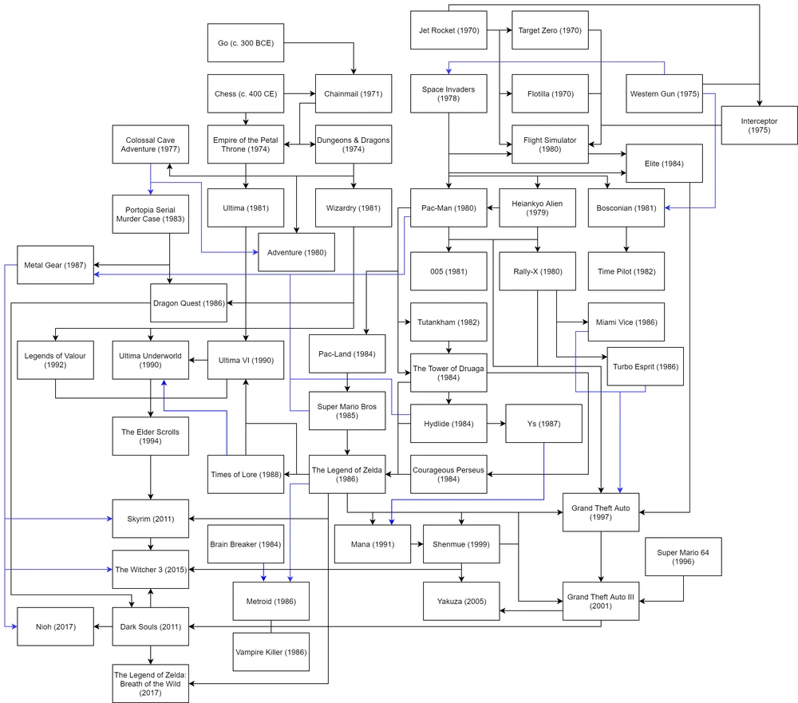
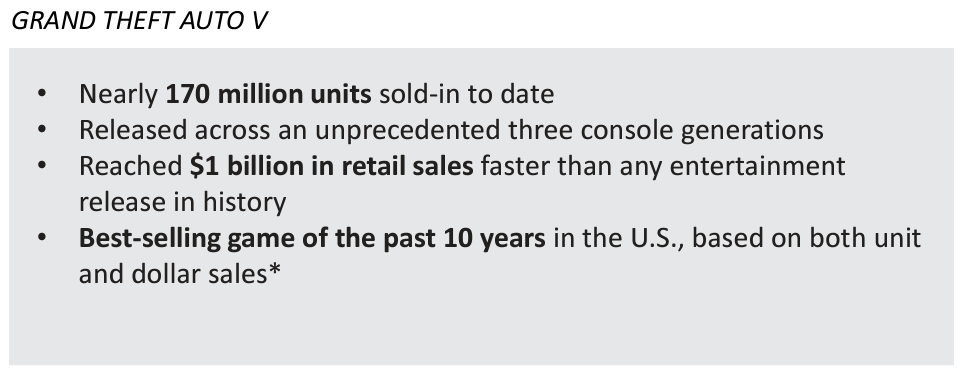
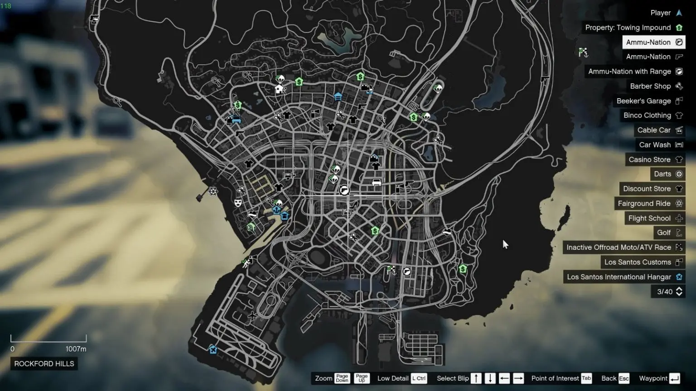
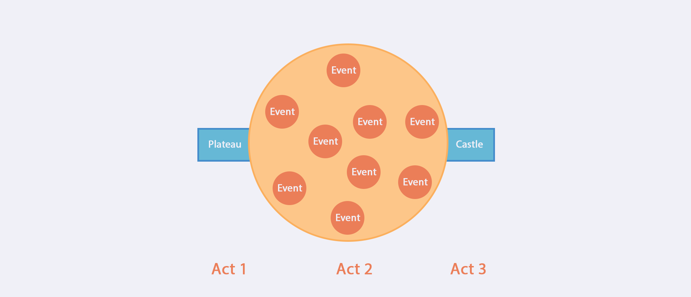
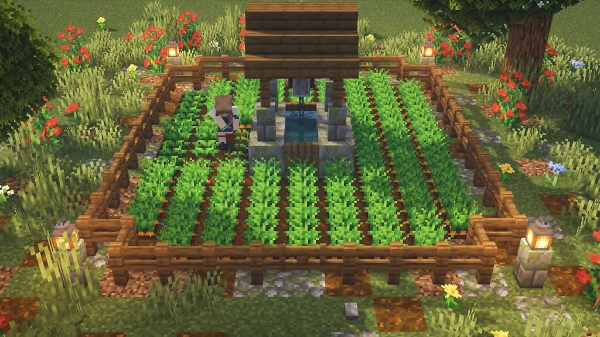

---

## This article has been revised and moved to my outcome page of ENGL 182, check [here](https://engl182.xsl.sh/).

---

## Introduction

***
Video games, as a cultural carrier and art form that is being increasingly important in modern entertainment, have gone and are still going through a rapid and unique process of development. In the short history of less than a hundred years, a variety of game genres and implementations have emerged. The open-world game, one of which genres are quite popular and of mainstay today, has flourished ever since it was defined, and evolved out of the continuous innovation of the industry and players, along with the birth of many video game classics.

*The roots and development of Open-world games (Codex Gamicus)*

This essay will focus on three open-world games that are considered canon – Grand Theft Auto V, The Legend of Zelda: Breath of the Wild, and Minecraft - to conduct rhetorical analysis on each and discuss the fundamental elements of the genre, how it evolved to meet the developing expectations of players and created great commercial success, and how it conveyed the value of games in its way.

## Analysis

***

Rhetorically, as all video games have players as the audience and game designers as composer, it would be helpful to set a base tune for the two's rhetorical purposes at the beginning. For players reaching video games, the modern entertaining method, they are expecting to relax, a temporary pulling away from reality, from the pressure and pending tasks, to obtain a good mood. Accordingly, whether and how much immersive experience is offered by the game becomes the standard to examine how rhetorically effective is the game. On the other hand, for game designers, maximizing the power of persuasion of the game is what they would put effort into. That is, to make players more engaged in the game and have more fun.

In terms of genre, although there may be common parts that the three samples clearly share, they vary considerably in terms of progression structure, game setting, etc. Thus, analyzing each example first is necessary to find out the negotiable and non-negotiable conventions of open-world games.

## Grand Theft Auto V

Having “nearly 170 million units sold-in to date” and being the “best-selling game of the past 10 years in the U.S.” (Take-Two Interactive 10), Grand Theft Auto V (GTA V) has been made a sort of cultural symbol representing all video games by gaining epic success and enormous popularity. What has made it topped among all the AAA (high-budget, high-profile) games with incredible vitality is undoubtedly its groundbreaking game design, particularly, its open-world game design.

*The impressive sales score of GTA V (Take-Two Interactive 10)*

The game is staged in a fictional version of Los Angeles – Los Santos. In the game, players can play as three distinctive characters – a middle-aged con man struggling to escape his past for a decent living, a young gangster from downtown, seduced by the prospect of greater achievements, and a psychopath who lives on drug deals and bloody violence – and freely switch between them, a black-comedy plotline just flit between the main characters’ daily lives.

In this game, the composers focused on the aspect of realism when creating an immersive experience. The game silently operates a bunch of complex systems based on rules of reality, from macro ones like the weather, finance, media, traffic, and internet to an abundant set of vehicles and firearms, lots of NPCs (non-playable characters) that are capable to react to the player's behaviors naturally and appropriately, and a whole police department, etc. By constantly interacting with these systems, players feel the vitality of this virtual world and thus develop more empathy.

*The in-game stock market (Smith)*

On the other hand, the plot and side quests jointly proposed intelligent and hilarious satires on an absurd, bestial, and hypocritical part of contemporary (when it’s released) society through deliberate game design. For example, there was a mission where Mike – the middle-aged con man –  was tasked to sneak into LifeInvader, a company operating a social network with a billion users. In this elaborate scene, players can find satirical elements about how tech companies abuse user data and violate user privacies, and hear buffoonery conversations between NPCs about business competition and marketing. The strong power of narrative stabs the audiences, and such pain in turn makes them relate to and reflect on reality.

The virtual world is also quite close in scale to a real city for the player. It takes time to travel in the virtual city no matter via walking, driving, or flying. Additionally, the city is filled with a variety of events and special locations, allowing players constantly find something interesting while hanging around. Besides a big amount of side quests and random missions, players got options like tennis, golf, hunting, diving, triathlon, racing, vehicle modification, etc in these special locations. The enriched world-building makes the world-setting more persuasive.

*Map with markers*

All these factors combined make GTA V extremely effective and successful in creating an immersive gaming experience. This is exactly why it is beloved and enjoyed by players after ten years after its release. Its practice of indicating special locations and pending quests by placing markers on the map actually became a common standard within the genre and gets widely adopted by its successors.

## The Legend of Zelda: Breath of the Wild

Widely awarded, highly regarded, and considered a masterclass (IGN), The Legend of Zelda: Breath of the Wild (BotW) has achieved a new milestone for open-world games with its innovative, bold and effective game design.

As the open-world game evolves, a cost-effective but annoying trend emerged. Instead of spending time and money adding details and polishing gameplay, game designers begin to fill the game with more mass-produced side quests to ensure the size of the game content. These side quests are extremely similar in structure, centering on minor random characters, and have only negligible impact on the main plot.  Players soon get tired of the list of question marks and lose their enthusiasm for playing. From a rhetorical point of view, the immersion is broken since the entertaining-oriented exploration gets replaced by a heavy to-do list, thus the expression is no longer effective and audiences tend to refuse to accept.

BotW got rid of all the question marks as well as those tiredsome side quests. Players are told an ultimate goal at the beginning of the game, which is to fight a evil, powerful and long-reign monster and bring back the kidnapped princess. Beyond that, players have nearly unlimited freedom to explore, treasure hunt, combat, unlock abilities, get upgrades, and trigger plots in a huge fantasy world. Players don't gain pleasure from completing given tasks, but from exploring the world and solving puzzles. Although there are no explicit instructions, some deliberate game designs (e.g. natural regional divisions made by different geographical features) usually make players progress the game in ways the designers would expect. On top of that, the explorable game content is abundant enough so that players do not feel lost.

*Abundant explorable resources (marks shown after completed) (Sneezes)*

Meanwhile, BotW grants players great freedom in terms of how to play the game. Unlike some that'd set rigid difficulty gaps to create fixed game progression order, BotW encourages players to apply creative thinking to whatever they have at the moment to work out the puzzle, and once they try, they will likely get rewarded. The same applies when players encounter combats. So when players play, there is no mandatory order to follow; instead, they follow pure curiosity to explore and have fun. This intuitive gaming manner outputs great experiences by valuing the player's subjective will, making it easier for audiences to feel immersed when they act on their own thoughts and are not constrained too much.

*The non-linear progression structure of BotW (Savant)*

By presenting an innovative game design, BotW has explored a new path of open-world games other than GTA V's realism. It produced excellent immersive experiences by giving players more freedom and room for creativity to spark, thus gaining so much praise and popularity.

## Minecraft

And in terms of leaving room for players' creativity and giving freedom, Minecraft has gone to an undoubted pinnacle. In Minecraft, players are spawned in a randomly generated world. The only and most important rule is that the game is over whenever the player dies, and everything else is left to the player to explore and create. No plot, no ultimate goal, and even no ending point. This infinite world will continue to exist in infinite time, as long as the player is still playing, there would be infinite possibilities.

But this game is not all about creation. The composers are well aware that players can get into "boredom". So "in order to build immersion in the game" and “reflect a bouncing between the boredom of construction and the anxiety of survival” (Duncan), Minecraft is filled with abundant survival elements.

To survive, players would quickly find that they need to eat, sleep, hunt and fight mobs, etc. An immersion emerges as a player builds a house, establishes strongholds and villages, begins to cultivate, tame and breed, etc. A sense of achievement of building everything from scratch would consistently strengthen such immersion.

*A player farming in Minecraft*

## Genre Analysis

***
The first intuitive observation from the three games is that the player is placed in an open environment – sometimes after a brief introduction of background story while sometimes not – and provided with a set of approaches to interact with the surroundings. It’d be natural to conclude a first non-negotiable convention of open-world games: `providing a free-roaming and interactive environment`.

Also in the rhetorical analysis of each sample, it's noted that all of them try  `creating an immersive entertaining experience` for the players, so this should be the second non-negotiable convention.

Thirdly, this virtual environment should be `scaled appropriately for players to travel and interact`. So that the environment can contain enough spatial elements to form the landscape of a world, while not being too strange in size.

And since the three samples are different in whether to have quests, plots, NPCs, or even an ultimate goal, they're all negotiable.

The reason open worlds are so popular is that they offer players a chance to transfer from real life to an alternative world where, for a brief period of time, players can sink into this wonder and fantasy environment while maintaining a significant degree of autonomy. This produces a unique experience for each player and that brings greater relaxation and entertainment compared to linear narrative games. As a result, open-world games have developed rapidly over the past two decades.

All in all, video games are making pivotal influences in modern culture and is becoming an inseparable part of our everyday life. Open-world games are currently the mainstay of video games and will continue to be so. In the foreseeable future, one can expect to see more open-world games redefining the genre with innovation and creating more exciting and immersive gaming experiences that would expand people's imagination and expectations toward video gaming.

## Sources

***
Take-Two Interactive. “Investor Presentation - August 2022.” *Q1 2023 Take-Two Interactive Software, Inc. Earnings Conference Call*, 8 Aug. 2022 <http://ir.take2games.com/static-files/79bc5b0a-2091-483f-9ac5-aa4cab0a1cac>.

IGN. “Verdict.” *The Legend of Zelda: Breath of the Wild Review*, 2 Mar. 2017, <https://www.ign.com/articles/2017/03/02/the-legend-of-zelda-breath-of-the-wild-review>.

Duncan, Sean C. “Minecraft, Beyond Construction and Survival”. 23 Oct. 2019.

Codex Gamicus. “History.” *Open-World Video Games*, <https://gamicus.fandom.com/wiki/Open-world_video_games#History>.

Smith, Josh. *GTA 5 Stock Market Pump and Dump Scheme Promises Fast Cash.* 1 Oct. 2013, <https://www.gottabemobile.com/gta-5-stock-market-pump-dump-scheme-promises-fast-cash/>.

Sneezes. *Sharing a map I made to help me track korok seeds and shrines*, 2016, <https://www.reddit.com/r/Breath_of_the_Wild/comments/63uq6g/sharing_a_map_i_made_to_help_me_track_korok_seeds/>

Savant, Bald. “Nonlinear Story Structure in Games.” *Blog of The Bald Savant*, 10 Jan. 2019, <http://baldsavant.blogspot.com/2019/01/nonlinear-story-structure-in-games.html>.

## Reflection

***
When I compose these open-world games, I will be following the conventions from the above analysis.
First, make sure to include all non-negotiable conventions: I will build a properly sized, interactive, and free-roaming open environment, and try to create an immersive gaming experience.
In terms of world creation, I need to consider the following:

+ Do I include a progression structure of plots + side quests? If so, how frequently? How to display them? (On the map with marks?)
+ Do I generate the world infinitely (randomly)? Or pre-build it?
+ Do I divide it into different areas? If so, how? What kind of landscape will I include?
...

And to create an immersive experience, I need to make sure I balance the player's autonomy and the intent of the composer. Not letting players lose, as well as not setting too many constraints.

***
When I compose this assignment, I have to be always aware of my audience's background knowledge. I assume that the audiences have no idea about what an open-world game is and what the three examples I will be talking about look like, so I will structure the content to make sure all the background information is introduced before the analysis begins.
