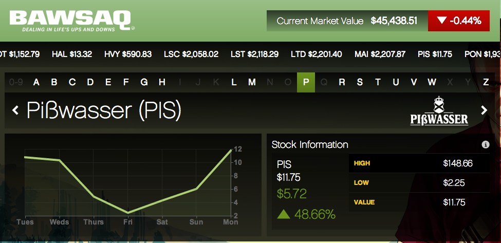

## Introduction

***
Video games, as a cultural carrier and art form that is being increasingly indispensable in modern entertainments, have gone and is still going through a unique and rich path of development. In the short history of less than a hundred of years, a variety of game genres and implementations have emerged. And open-world game, one of which genres that are quite popular and of mainstay today, has flourished ever since it was defined, and evolved out of the continuous innovation of the industry and players, along with the birth of many video game classics.

*The roots and development of Open-world games (Codex Gamicus)*

This essay will focus on three open world games that are considered canon – Grand Theft Auto V, The Legend of Zelda: Breath of the Wild and Minecraft - to conduct rhetorical analysis on each and discuss the fundamental elements of the genre, how it evolved to meet the developing expectations of players and created great commercial success, and how it conveyed the value of game in its way.

## Analysis

***

Rhetorically, as all video games have players as the audience and game designers for composer, it would be helpful to set a base tune for the two's rhetorical purpose at the beginning. For players reaching video games, the modern entertaining method, they are expecting relax, a temparary pulling away from reality, from the pressure and pending tasks, to obtain a good mood. Accordingly, whther and how much immersive experience is offered by the game becomes the standard to examine how rhetorically effective is the game. On the other hand, for game designers, maximize the power of persuasion of the game is what they would put effort into. That is, to make players more engaged in the game and have more fun.

In terms of genre, although there may be common parts that the three samples clearly share, they varies considerably in terms of progression structure, game setting, etc. Thus, conducting analysis on each example is necessary to find out the negotiable and non-negoriable conventions of open-world games.

## Grand Theft Auto V

Take a look at Grand Theft Auto V first, having “nearly 170 million units sold-in to date” and being “best-selling game of the past 10 years in the U.S.” (Take-Two Interactive 10), it has been made a sort of cultural symbol representing all video games by gaining epic success and enormous popularity. What has made it topped among all the AAA (high-budget, high-profile) games with incredible vitality is undoubtedly its groundbreaking game design, particularly, its open-world game design.

*The impressive sales score of GTA V (Take-Two Interactive 10)*

The game is staged in a fictional version of Los Angeles – Los Santos. In the game, players can play as three distinctive characters – a middle-aged con man struggling to escape his past for a decent living, a young gangster from downtown, seduced by the prospect of greater achievements, and a psychopath who lives on drug deals and bloody violence – and freely switch between them, a black-comedy plotline just flit between the main characters’ daily lives.

In this game, the composers focused on aspect of realistic when creating an immersive experience. The game silently operates a bunch of complex systems based on reality rules, from macro ones like the weather, finance, medias， traffic and internet to an abundant set of vehicles and firearms, lots of NPCs (non-playable character) that are capable to react to the player's behaviors naturally and appropriately, and a whole police department, etc. By constantly interacting with these systems, players feel the vitality of this virtual world and thus develop more empathy.

*The in-game stock market (Smith)*

On the other hand, the plot and side quests jointly proposed an intelligent and hilarious satires on an absurd, bestial, and hypocritical part of contemporary (when it’s released) society through deliberate game design. For example, there was a mission where Mike – the middle-aged con man –  was tasked to sneak into LifeInvader, a company operating a social network with a billion users. In this elaborate scene, players can find satirical elements about how tech companies abuse user data and violate user privacies, and hear buffoonery conversations between NPCs about business competition and marketing. The strong power of narrative stabs the audiences, and such pain in turn makes them relate and relect more to reality.

The virtual world is also quite close in scale to a real city for the player. It takes time to travel in the virtual city no matter via walking, driving or flying. Additionally, the city is filled with a variety of events and special locations, allowing players constantly find something interesting while hanging around. Besides a big amount of side quests and random missions, players got options like tennis, golf, hunting, diving, triathlon, racing, vehicle modification, etc in these special locations. The enriched world building makes the world setting more persuasive.

*Map with markers*

All these factors combined make GTA V extremely effective and successful in creating an immersive gaming experience. This is exactly why it is beloved and enjoyed by players after ten years from its release. Its practice of indicating special locations and pending quests by placing markers on the map actually became a common standard within the genre and gets widely adopted by its successors.

## The Legend of Zelda: Breath of the Wild

However, The Legend of Zelda: Breath of the Wild (BotW) broke the rule. As open-world games evolve, game producers fill the game content with more and more quests to extend game time, and completing them is required to enter the next stage. Players soon get tired of the list of question marks that stifle their enthusiasm for playing. From a rhetorical point of view, too many to-dos destroyed the immersion of fun-driven explorations and disobeyed the audiences’ main purpose of entertainment.

Aside from a few major teleportation points, the map of Breath of the Wild has barely a mark. Only a few markers of treasures may appear as players approach them to indicate the location. Players are told the ultimate goal at the very beginning, and beyond that players have nearly unlimited freedom to explore, treasure hunt, combat, unlock abilities, get upgrades and trigger plots in the virtual world the game provides. There are no forced progression stages, but the game content is abundant enough to not make players lost.

Here, Breath of the Wild went even further in granting players freedom, shedding the commanding and mandatory task list, and relying sheerly on the subtlety of puzzle design and the abundance of exploration elements to make it fun. Breath of the Wild sets no mandatory barriers regarding areas but does create a difficulty difference in different periods of game. Players can interact with in-game objects intuitively, and they’re likely to respond in a surprisingly reasonable way. Such balance of freedom and fun brought about a breakthrough on creating immersive experiences, and helped it win players’ wide love and the review of “masterclass” (IGN).

## Minecraft

And in terms of granting players freedom, Minecraft has gone to an undoubted pinnacle. Place the player in the virtual world and then just leave everything entirely to creativity.

Unlike the previous examples, players of Minecraft don’t even seem to have an ultimate goal. On the other hand, such aimless game setting may indeed cause players to get into “boredom”, so the game designer introduced a survival mode "in order to build immersion in the game" and “reflect a bouncing between the boredom of construction and the anxiety of survival” (Duncan). Combining survival and creation, Minecraft accordingly has turned into a long-beloved open-world game.

## Genre Analysis

***
From the perspective of someone knows barely anything about open-world games, the first observation from the three games is that the player is placed in an open environment – sometimes after a brief introduction of background story while sometimes not – and provided with a set of approaches to interact with the surroundings. It’d be natural to conclude a first non-negotiable convention of open-world games: `providing a free-roaming and interactive environment`. However, the three samples appeares to be vary much, so the exploration of other conventions would be needing to dive into analysis of each example.

Thus, telling from the three examples, the immersive game experience is also a non-negotiable convention of open-world games. Whether to have quests, plot, NPCs, or even an ultimate goal are all negotiable. The reason why open-world is so popular as a game genre is that it provide players with the ability to interact with a virtual world freely and create an immersive experience. One allows players to play with fewer constraints, making it possible to enjoy the game in the manner and pace the player like; the other one helps convey the game's worldview (and story) more effectively, making the emotion or characters’ arc more persuasive.

All in all, video games are making pivotal influences in modern culture and is becoming an inseparable part of our everyday life. Open world games are currently the mainstay of video games and will continue to be so. In the foreseeable future, one can expect to see more open-world games redefining the genre with innovation and creating more exciting and immersive gaming experiences that would expand people's imagination and expectations toward video gaming.

## Sources

Take-Two Interactive. “Investor Presentation - August 2022.” *Q1 2023 Take-Two Interactive Software, Inc. Earnings Conference Call*, <http://ir.take2games.com/static-files/79bc5b0a-2091-483f-9ac5-aa4cab0a1cac>.

IGN. “Verdict.” *The Legend of Zelda: Breath of the Wild Review*, 2 Mar. 2017, <https://www.ign.com/articles/2017/03/02/the-legend-of-zelda-breath-of-the-wild-review>.

Duncan, S. C. *Minecraft beyond construction and survival. Well Played 1(1)* 1-22, 2011, <http://etc.cmu.edu/etcpress>.

Codex Gamicus. “History.” *Open-World Video Games*, <https://gamicus.fandom.com/wiki/Open-world_video_games#History>.

Smith, Josh. *GTA 5 Stock Market Pump and Dump Scheme Promises Fast Cash.* 1 Oct. 2013, <https://www.gottabemobile.com/gta-5-stock-market-pump-dump-scheme-promises-fast-cash/>.
